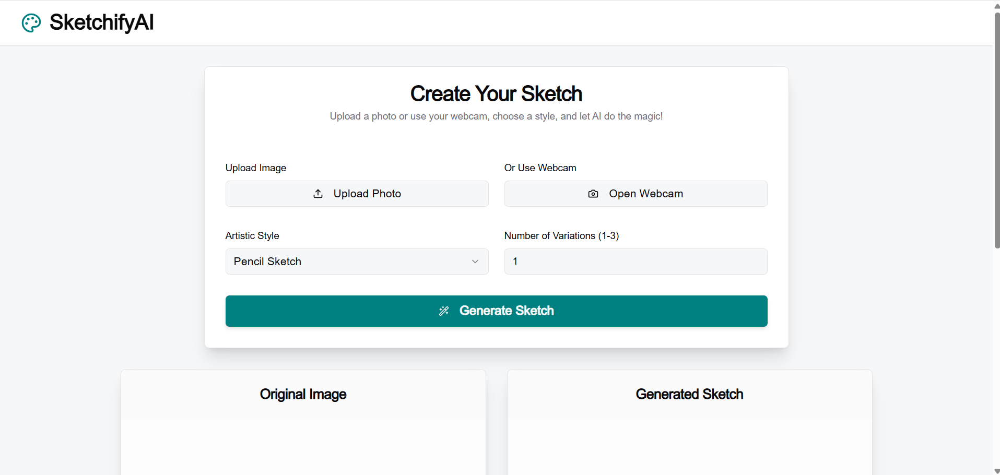
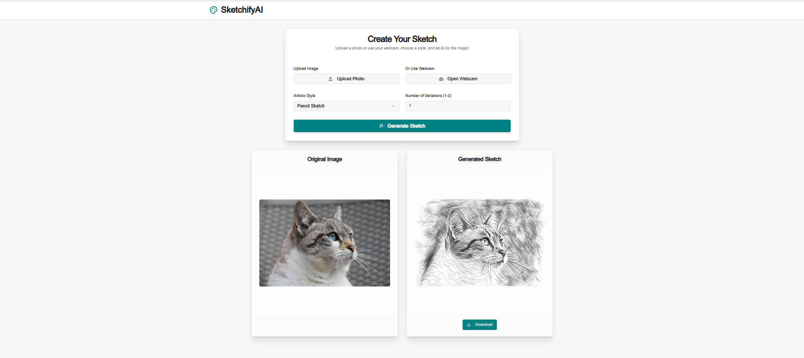

🎨 SketchifyAI
SketchifyAI is a full-stack AI-powered image-to-sketch web application. Built using Flask (Python) for the backend and modern frontend technologies, the app allows users to upload an image or use a webcam, select an artistic style, and generate a sketch version in real-time. It features a clean and responsive interface with support for image uploads, sketch previews, and downloads.

📸 Preview

### Upload and Generate Interface

### Example Output

🚀 Features
🖼️ Upload photo or use webcam to capture

✏️ Generate AI-based sketches

🎨 Choose between sketch styles (e.g., pencil)

📥 Download generated sketch

🔄 Real-time rendering with fast preview

🌐 CORS-enabled backend for smooth API calls

💡 Intuitive UI built with HTML, CSS (Tailwind/Vanilla), JS

🛠️ Tech Stack
Frontend
HTML + CSS

JavaScript

Tailwind CSS (optional for styling)

Backend
Flask

Flask-CORS

Python

📁 Folder Structure
pgsql
Copy
Edit
SketchifyAI/
├── backend/
│   └── app.py
├── frontend/
│   ├── index.html
│   ├── styles/
│   ├── scripts/
│   └── assets/
├── screenshots/
│   ├── original.png
│   └── sketch.png
└── README.md
⚙️ Setup Instructions
Prerequisites
Python 3.x

pip (Python package manager)

1. Clone the Repository
bash
Copy
Edit
git clone https://github.com/your-username/SketchifyAI.git
cd SketchifyAI
2. Backend Setup
bash
Copy
Edit
cd backend
pip install flask flask-cors
Create a backend/app.py file with:

python
Copy
Edit
from flask import Flask, jsonify
from flask_cors import CORS

app = Flask(__name__)
CORS(app)

@app.route('/')
def hello_world():
    return jsonify(message='Hello from Flask API!')

@app.route('/api/sample', methods=['GET'])
def get_sample_data():
    return jsonify({
        "id": 1,
        "name": "Sample Item",
        "description": "This is a sample item from the Flask API.",
        "version": "1.0.0"
    })

@app.route('/api/process', methods=['POST'])
def process_data():
    return jsonify({
        "status": "placeholder",
        "message": "This endpoint is ready to process POST data."
    })

if __name__ == '__main__':
    app.run(debug=True, port=5001)
Start the backend server:

bash
Copy
Edit
python app.py
3. Frontend Setup
Simply open frontend/index.html in your browser, or serve it via a local server (e.g., VSCode Live Server).

🌐 Deployment
✅ Backend can be deployed using services like Render, Railway, or Heroku.

✅ Frontend can be deployed on GitHub Pages, Netlify, or Vercel.

🔁 You can integrate both using Flask to serve static files if needed.

🔒 Environment Variables (Optional)
You can use .env files for secrets if integrating ML models or cloud storage.

🧪 Testing
✅ Upload image and check if preview shows

✅ Click "Generate Sketch" to test sketch rendering

✅ Try webcam input (if supported)

✅ Click download button to save result

🤝 Contributions
Feel free to fork the repo and submit a pull request. All improvements and suggestions are welcome!

📄 License
This project is licensed under the MIT License.
